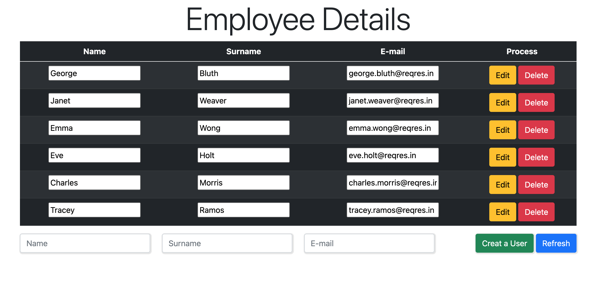

# JS-Fetch-API-CRUD

First of all, I created the data I received from the API, followed by reading, updating and deleting.

With this project, we got better knowledge about fetch.

HTTP is a protocol that allows us to communicate between the browser and the server.
There are some http methods ( GET, POST, PUT, HEAD, DELETE, OPTION, CONNECT, PATCH ...)

In this article, I will only give information about the methods I used in this project.
`GET`: This method is used to get data from the server.

`POST`: You can print data to the server with this method. With this method, request parameters can be sent both in the URL and in the message body.

`PUT`: With this method you can update a resource on the service provider.

`DELETE`: With this method, you can delete any data on the server.

#What is the Fetch API?
Fetch API is a simple interface for fetching resources (including network-wide). It allows us to receive and send data asynchronously as an alternative to Ajax. It is an async structure because it is based on Promise. It's a feature that comes with Promise ES6.

Here is the link where I pulled the data and also used in Fetch: https://reqres.in/api/users

Source: https://reqres.in/
